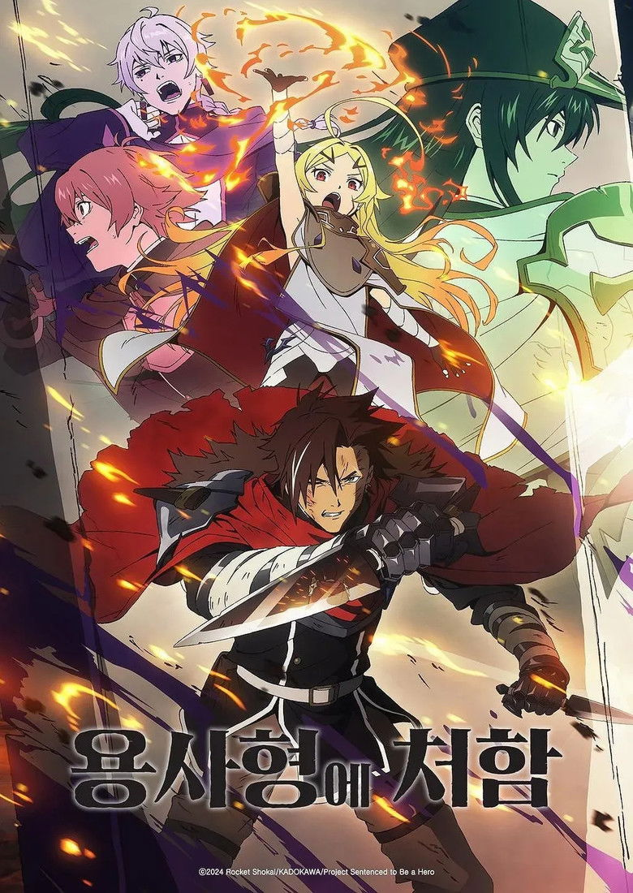

# [2026 겨울 애니] 용사형에 처함 - 정보 & 리뷰

## 💡 도입부

"용사"라는 단어에서 어떤 이미지가 떠오르시나요? 대부분은 빛나는 갑옷, 정의의 수호자, 영웅적인 모습을 상상할 겁니다. 하지만 <용사형에 처함>은 이 모든 통념을 산산조각 냅니다. 이 세계에서 용사란 영광이 아닌 **가장 끔찍한 형벌**이며, 죽음조차 허락되지 않는 지옥 같은 운명입니다.

2026년 겨울 애니메이션 시즌의 최대 화제작으로 떠오른 이 작품은 첫 에피소드를 58분이라는 파격적인 러닝타임으로 선보이며 강렬한 인상을 남겼습니다. Reddit r/anime에서는 에피소드 1 토론 스레드가 3,941개의 추천과 1,130개의 댓글을 기록하며 폭발적인 반응을 얻었고, MAL에서 8.22/10이라는 높은 평점과 함께 21만 명 이상의 멤버가 리스트에 추가하며 그 인기를 입증했습니다.

다크 판타지와 안티히어로의 결합, 그리고 신들의 음모와 복수라는 무거운 주제를 다루면서도 독특한 캐릭터들의 케미스트리로 균형을 잡는 이 작품은 2026년을 여는 가장 강력한 다크호스입니다.

## 📋 기본 정보

- **제목**: 용사형에 처함 (勇者刑に処す　懲罰勇者9004隊刑務記録)
- **영문 제목**: Sentenced to Be a Hero
- **장르**: 액션, 코미디, 드라마, 판타지
- **제작사**: Studio KAI
- **방영 시작**: 2026년 1월 3일
- **방영 채널**: Tokyo MX
- **에피소드 수**: 12화
- **원작**: 라이트 노벨 (만화판도 연재 중)
- **감독**: 타카시마 히로유키
- **각본**: 이하라 켄타

### 📊 평점 비교표

| 플랫폼 | 평점 | 비고 |
|--------|------|------|
| **AniList** | 79/100 | 글로벌 애니 DB |
| **MyAnimeList** | 8.22/10 | #409 (전체 순위), #1,264 (인기) |
| **TMDB** | 8.9/10 | 37명 평가 |
| **MAL 멤버 수** | 219,207명 | 높은 관심도 지표 |

### 🎬 스트리밍 정보
- **Crunchyroll**: [공식 시청 페이지](https://www.crunchyroll.com/series/GT00356809/sentenced-to-be-a-hero)
- 한국어 자막 지원 (확인 필요)

## 📖 스토리 소개

<용사형에 처함>의 세계관은 기존 판타지의 공식을 완전히 뒤집습니다. 이 세계에서 "용사"는 명예로운 칭호가 아닌, 중죄인에게 내려지는 최악의 형벌입니다. 용사형을 선고받은 자들은 마왕과 끝없이 쏟아지는 마물들과 싸워야 하며, 전투에서 죽더라도 강제로 부활되어 다시 싸움터로 내몰립니다. 죽음조차 탈출구가 될 수 없는, 문자 그대로의 지옥이 바로 "용사"의 운명입니다.

주인공 자이로 폴바츠는 전직 성기사단 단장이었으나, 여신을 살해했다는 죄목으로 용사형을 선고받습니다. 그는 징벌용사 9004부대를 이끌게 되는데, 이 부대는 그야말로 성격 파탄자, 살인자, 배신자들로 구성된 최악의 문제아 집단입니다. 하지만 자이로에게는 명확한 목표가 있습니다. 바로 **살아남아서 자신을 함정에 빠뜨린 자들에게 복수하는 것**입니다.

이야기는 자이로가 전장의 최전선에서 검의 "여신" 테오리타를 만나면서 새로운 국면을 맞이합니다. 테오리타는 최강의 생체 병기이지만, 인간적인 감정과 욕구를 가진 복잡한 존재입니다. "적을 섬멸하고 나면, 내게 칭찬을 하고... 그리고 머리를 쓰다듬으세요"라는 그녀의 계약 조건은 이 다크 판타지에 의외의 감성을 불어넣습니다.

자이로와 테오리타의 계약은 단순한 전력 강화를 넘어, 이 절망적인 시스템 자체에 대한 반란의 시작점이 됩니다. 신들의 음모, 용사형이라는 시스템의 진실, 그리고 자이로를 배신한 자들의 정체가 서서히 드러나면서, 이야기는 단순한 생존 서바이벌을 넘어 거대한 음모극으로 확장됩니다. 12화라는 짧은 분량 안에 복수, 반역, 그리고 희망이라는 무거운 주제들이 촘촘하게 직조되어 있습니다.

## 🎬 주요 캐릭터 & 성우진

### 자이로 폴바츠 (Xylo Forbartz)
전직 성기사단 단장이자 징벌용사 9004부대의 리더입니다. 여신 살해라는 중죄로 용사형을 선고받았지만, 그는 자신이 함정에 빠졌다고 확신합니다. 냉철하고 전략적인 지휘관이면서도, 자신의 목표를 위해서라면 악마와도 손잡을 수 있는 실용주의자입니다. 수많은 죽음과 부활을 겪으면서도 복수라는 목표를 잃지 않는 강인한 정신력의 소유자이며, 문제아 집단인 부대원들을 효과적으로 통솔하는 리더십을 보여줍니다.

### 테오리타 (Teoritta)
검의 여신이라 불리는 최강의 생체 병기입니다. 압도적인 전투력을 자랑하지만, 칭찬과 머리를 쓰다듬어주는 것을 대가로 요구하는 독특한 캐릭터입니다. 그녀의 순수한 듯 보이는 외면 아래에는 복잡한 과거와 감정이 숨겨져 있으며, 자이로와의 관계를 통해 점차 인간적인 면모를 드러냅니다. 전투 장면에서는 압도적인 파괴력을, 일상 장면에서는 의외의 귀여움을 선보이는 갭 매력이 큰 캐릭터입니다.

### 파토셰 키비아 (Patausche Kivia)
징벌용사 9004부대의 일원으로, 각자의 어두운 과거를 가진 부대원 중 한 명입니다. 부대 내에서 독특한 역할을 담당하며, 자이로의 전략 수행에 중요한 역할을 합니다. 성격 파탄자들의 집합인 부대에서 나름의 균형감각을 제공하는 캐릭터입니다.

### 도타 루즈라스 (Dotta Luzulas) & 베네팀 레오풀 (Venetim Leopool)
9004부대를 구성하는 또 다른 문제아들입니다. 각자 중죄로 용사형을 선고받았지만, 극한 상황에서 나름의 전투 스타일과 철학을 가지고 있습니다. 이들의 과거와 현재가 교차하면서 "악인"과 "영웅"의 경계가 모호해지는 작품의 주제를 효과적으로 전달합니다.

성우진 정보는 아직 공개되지 않았지만, Studio KAI의 제작 역량과 다크 판타지 장르의 특성을 고려할 때, 베테랑 성우진이 캐스팅될 것으로 기대됩니다.

## ✨ 이 작품의 볼거리 3가지

### 1. 전복된 영웅 서사와 다크 판타지의 새로운 지평 🗡️
<용사형에 처함>은 "용사"라는 개념 자체를 해체합니다. 영웅이 형벌이 되는 세계관, 죽음조차 허락되지 않는 잔혹한 시스템은 기존 이세계물이나 판타지 애니메이션과는 완전히 다른 접근입니다. 이는 단순한 설정의 반전이 아니라, 영웅주의, 희생, 정의라는 개념들에 대한 근본적인 질문을 던집니다. 첫 에피소드부터 58분이라는 파격적인 러닝타임으로 이 독특한 세계관을 깊이 있게 구축하며, 시청자를 완전히 새로운 판타지 세계로 끌어들입니다.

### 2. 복수극과 음모, 그리고 신들의 게임 🎭
자이로의 복수 여정은 단순한 개인적 앙갚음을 넘어, 신들과 권력자들이 만들어낸 부패한 시스템에 대한 도전으로 확장됩니다. 여신 살해라는 죄목, 용사형이라는 시스템, 그리고 배후에 숨겨진 음모들이 서서히 밝혀지면서 이야기는 거대한 스케일의 권력 투쟁으로 발전합니다. 각 에피소드마다 새로운 진실이 드러나고, 시청자의 추측을 뒤엎는 반전이 기다리고 있습니다. Reddit 토론 스레드에서 1,130개가 넘는 댓글이 달린 것은 이 복잡한 서사가 얼마나 많은 논의거리를 제공하는지 보여줍니다.

### 3. 안티히어로들의 케미스트리와 예상 밖의 감성 💔
징벌용사 9004부대는 각자가 중죄인이자 성격 파탄자들입니다. 하지만 이들의 상호작용은 예상외로 유머러스하고 때로는 감동적이기까지 합니다. 특히 자이로와 테오리타의 관계는 이 다크한 세계관에 독특한 온기를 불어넣습니다. "칭찬해주고 머리를 쓰다듬어달라"는 테오리타의 요구는 최강 병기의 순수함과 인간적 욕구를 동시에 보여주며, 잔혹한 전투 장면들 사이사이에 의외의 힐링 포인트를 제공합니다. 이런 감성적 균형이 작품을 단순한 고어 액션물이 아닌, 깊이 있는 캐릭터 드라마로 승화시킵니다.

## 🌐 해외 팬 반응

Reddit r/anime 커뮤니티에서 <용사형에 처함>은 2026년 겨울 시즌의 최대 화제작 중 하나로 떠올랐습니다. "Winter 2026 release calendar" 게시글에서 5,100개의 추천과 353개의 댓글을 기록하며 시즌 시작 전부터 높은 기대를 받았고, 첫 에피소드 방영 후 토론 스레드는 3,941개의 추천과 1,130개가 넘는 댓글로 폭발적인 반응을 얻었습니다.

해외 팬들은 특히 58분이라는 첫 에피소드의 파격적인 러닝타임과 세계관 구축의 깊이를 높이 평가했습니다. "이 정도 퀄리티로 12화를 유지할 수 있을까?"라는 기대 반 걱정 반의 반응과 함께, 다크 판타지 장르 팬들 사이에서는 이미 컬트 클래식 반열에 오를 가능성이 논의되고 있습니다.

TMDB 8.9/10, AniList 79/100, MAL 8.22/10이라는 세 플랫폼 모두에서의 높은 평점은 작품의 완성도를 입증합니다. 특히 MAL에서 #409 전체 순위에 오른 것은 21만 명 이상의 멤버가 관심을 보이는 가운데 달성한 성과로, 단순히 화제성뿐 아니라 실제 작품성도 인정받았다는 의미입니다.

다크 판타지와 안티히어로 서사를 선호하는 서구권 팬들, 특히 <Jigokuraku (지옥낙원)>이나 <Berserk> 같은 작품을 즐겼던 시청자들 사이에서 특히 높은 반응을 얻고 있습니다. "이게 진짜 다크 판타지다"라는 평가와 함께, 최근 양산되는 가벼운 이세계물에 지친 팬들에게 신선한 충격을 주고 있습니다.

## 🎯 이런 분께 추천합니다

### ⚔️ 진짜 다크 판타지를 찾는 분들
<Jigokuraku (지옥낙원)>, <Berserk>, <도로헤도로> 같은 작품을 좋아하신다면 반드시 보셔야 합니다. 표면적인 어두움이 아닌, 세계관 자체가 절망적이고 시스템이 부조리한 진정한 다크 판타지를 경험할 수 있습니다. 고어 표현도 수위가 높은 편이니, 이런 요소를 즐기시는 분들께 강력 추천합니다.

### 🧠 복잡한 음모극과 반전을 좋아하시는 분들
단순한 액션이 아닌, 신들의 음모와 권력 구조에 대한 저항이라는 깊이 있는 서사를 원하신다면 이 작품이 제격입니다. 매 에피소드마다 새로운 정보가 공개되고, 캐릭터들의 진짜 의도와 과거가 밝혀지면서 퍼즐이 맞춰지는 쾌감을 느낄 수 있습니다.

### 💪 안티히어로 주인공을 선호하시는 분들
완벽한 정의의 영웅이 아닌, 복수를 위해 수단과 방법을 가리지 않는 현실적인 주인공을 좋아하신다면 자이로 폴바츠는 올해 최고의 안티히어로 캐릭터가 될 것입니다. <Mushoku Tensei>의 루데우스나 <Arifureta>의 하지메처럼 목적을 위해 타협하지 않는 주인공을 선호하신다면 필수 시청작입니다.

### 🎭 독특한 캐릭터 역학을 즐기시는 분들
문제아들로만 구성된 부대의 케미스트리, 그리고 자이로와 테오리타의 독특한 관계는 다크한 분위기 속에서도 예상 밖의 재미와 감동을 선사합니다. 캐릭터 중심의 서사를 선호하신다면 이 작품의 다층적인 캐릭터들이 큰 만족을 줄 것입니다.

## ⭐ 총평

<용사형에 처함>은 2026년 애니메이션 시즌의 가장 대담한 도전작입니다. "용사"라는 판타지의 가장 기본적인 개념을 완전히 뒤집어, 영웅 서사가 아닌 형벌과 복수의 이야기로 재구성한 발상은 신선함을 넘어 충격적입니다. 58분짜리 첫 에피소드로 세계관을 탄탄하게 구축하고, 이후 12화 동안 음모, 전투, 감성을 적절히 배합하며 긴장감을 유지하는 구성력은 높이 평가할 만합니다.

**강점**으로는 독창적인 세계관, 복잡하고 다층적인 캐릭터들, 그리고 단순한 선악 구도를 넘어선 도덕적 회색지대의 탐구를 꼽을 수 있습니다. 자이로와 테오리타의 관계는 다크 판타지에 예상치 못한 감성적 깊이를 더하며, 각 캐릭터의 과거와 동기가 서서히 밝혀지는 방식은 12화 내내 시청자의 흥미를 끌어당깁니다.

**약점**이 있다면, 고어와 폭력 수위가 높아 일부 시청자에게는 부담스러울 수 있다는 점, 그리고 12화라는 짧은 분량에 모든 복선을 회수하기에는 다소 촉박할 수 있다는 점입니다. 또한 다크 판타지 특유의 무거운 분위기가 지속되어, 가벼운 힐링 애니를 찾는 분들께는 맞지 않을 수 있습니다.

하지만 이런 약점들조차 작품의 정체성을 명확히 하는 요소들입니다. <용사형에 처함>은 타협하지 않습니다. 안티히어로, 다크 판타지, 복수극이라는 자신의 정체성을 끝까지 밀어붙이며, 바로 그 점에서 진정성을 획득합니다.

AniList 79/100, MAL 8.22/10, TMDB 8.9/10이라는 평점은 결코 과장이 아닙니다. 이 작품은 2026년 다크 판타지의 새로운 기준을 제시하며, 앞으로도 오랫동안 회자될 작품이 될 잠재력을 충분히 갖추고 있습니다.

**⭐⭐⭐⭐☆ 4.5/5**

**"영웅이 되는 것이 형벌이라면, 우리는 무엇을 위해 싸우는가? 2026년, 가장 대담한 질문을 던지는 다크 판타지의 걸작."**

---

### 해시태그
#용사형에처함 #SentencedToBeAHero #2026애니 #겨울애니 #다크판타지 #안티히어로 #StudioKAI #복수극 #징벌용사9004부대 #여신살해 #크런치롤 #판타지애니 #덕질 #애니추천 #신작애니