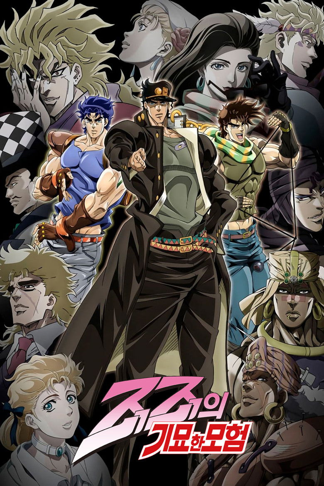

# [2026 겨울 애니] STEEL BALL RUN JoJo's Bizarre Adventure - 정보 & 리뷰

## 💡 도입부

드디어 기다리던 순간이 왔습니다. 죠죠러들이 10년 넘게 손꼽아 기다려온 그 이름, **『STEEL BALL RUN』**이 2026년 겨울 애니메이션으로 돌아옵니다. 이 작품은 단순한 시즌 연장이 아닙니다. 죠죠 시리즈의 7부작으로, 원작 만화가 '주간 소년 점프'에서 '울트라 점프'로 이적하며 본격적인 청년 만화로 거듭난 첫 작품이자, 많은 팬들이 "죠죠 시리즈 최고의 걸작"이라 평가하는 바로 그 작품입니다.

19세기 말 아메리카 대륙을 가로지르는 대륙 횡단 경마 레이스라는 독특한 설정, 역대 최고의 황금 콤비로 손꼽히는 죠니와 자이로의 우정, 그리고 스탠드와 회전 기술이 결합된 박진감 넘치는 전투까까지. 『STEEL BALL RUN』은 액션, 드라마, 미스터리가 완벽하게 조화를 이루는 작품입니다. Reddit r/anime에서 공개 티저 하나로 18,723개의 추천과 998개의 댓글을 기록한 것만 봐도 전 세계 애니메이션 팬들의 기대가 얼마나 뜨거운지 알 수 있습니다.

**한 줄 요약:** 1890년 아메리카를 배경으로 펼쳐지는 대륙 횡단 경마 레이스, 그 속에서 자신의 운명을 바꾸려는 두 남자의 기묘한 모험이 시작됩니다.

## 📋 기본 정보

**작품명**
- 한국어: 죠죠의 기묘한 모험: 스틸 볼 런
- 영어: STEEL BALL RUN JoJo's Bizarre Adventure
- 일본어: ジョジョの奇妙な冒険 スティール・ボール・ラン

**제작 정보**
- 장르: 액션, 어드벤처, 드라마, 미스터리, 초자연
- 제작사: David Production
- 방영 시작일: 2012년 10월 6일 (첫 에피소드 47분 특별편)
- 방영국: Tokyo MX, BS11
- 에피소드 수: 미정 (원작 분량상 3~4쿨 예상)

**평점 비교**

| 플랫폼 | 평점 | 순위/인기도 | 특이사항 |
|--------|------|-------------|----------|
| AniList | -/100 | - | 방영 전 |
| MAL | 정보 없음 | 인기순위 #2,728 | 멤버 78,988명 |
| TMDB | 8.6/10 | - | 1,533명 평가 |

**스트리밍:** Netflix 독점 공개 (https://www.netflix.com/title/82116553)

## 📖 스토리 소개

**세계관 배경**

때는 1890년, 미국 서부 개척 시대의 열기가 채 가시지 않은 시기입니다. 미국 대통령 퍼니 밸런타인의 주도 하에 역사상 전례 없는 이벤트가 개최됩니다. 바로 '스틸 볼 런(STEEL BALL RUN)' - 샌디에이고 해변에서 시작해 뉴욕까지 약 6,000km를 달리는 대륙 횡단 경마 대회입니다. 우승 상금은 무려 5천만 달러. 당시로서는 상상을 초월하는 금액에 전 세계에서 3,852명의 경주자들이 모여들었습니다. 하지만 이 레이스 뒤에는 '성인의 유해'라는 초자연적 비밀이 숨겨져 있습니다.

**주인공과 핵심 갈등**

죠니 죠스타, 한때 천재 기수로 불리며 켄터키 더비를 제패하던 청년은 불의의 총격 사고로 하반신을 잃고 절망 속에 살아갑니다. 그러던 어느 날, 의문의 이탈리아인 자이로 체펠리가 쇠구슬을 회전시켜 만들어낸 기적 같은 현상을 목격하게 됩니다. '회전의 힘'으로 자신의 다리를 되찾을 수 있다고 믿은 죠니는 스틸 볼 런에 참가를 결심합니다.

한편 자이로 체펠리는 사형수 소년의 목숨을 구하기 위해 이 레이스에 참가했습니다. 체펠리 가문에 전해지는 고대의 회전 기술을 익힌 그는 레이스 우승으로 국왕의 사면을 받아내야 합니다. 서로 다른 목적을 가진 두 사람은 레이스 도중 동맹을 맺고, 점차 진정한 동료이자 친구가 되어갑니다.

**이전 시리즈와의 연결**

『STEEL BALL RUN』은 죠죠 시리즈의 7부작이지만, 1~6부와는 완전히 독립된 평행세계의 이야기입니다. Stone Ocean의 엔딩 이후 새로운 우주로 재설정된 세계관에서 펼쳐지는 또 다른 죠스타 가문의 이야기죠. 친숙한 이름들(죠스타, 체펠리, 브란도 등)이 등장하지만, 전혀 다른 캐릭터와 관계로 그려집니다. 시리즈를 처음 접하는 분들도 부담 없이 시작할 수 있는 완벽한 진입점입니다.

**이번 작품만의 새로운 요소**

역대 죠죠 시리즈 중 처음으로 '역사적 실존 인물'들이 대거 등장합니다. 미국 대통령을 비롯해 실제 역사 속 인물들이 스탠드 능력자로 재해석되어 등장하죠. 또한 '황금장방형의 회전'이라는 새로운 능력 체계가 스탠드와 결합되어, 지금까지와는 차원이 다른 전투 연출을 선보입니다. 특히 말을 타고 질주하면서 벌이는 스탠드 배틀은 서부극과 초능력 액션의 완벽한 조합으로, 원작 팬들 사이에서 "가장 영상화를 기대했던 장면들"로 손꼽힙니다.

## 🎬 주요 캐릭터 & 성우진

**죠니 죠스타 (Johnny Joestar)**
본작의 주인공이자 7번째 죠죠. 하반신 마비라는 장애를 가진 죠죠 주인공은 시리즈 사상 처음입니다. 처음엔 자기중심적이고 나약했던 그가 자이로와의 여정을 통해 진정한 '황금정신'을 깨닫고 성장하는 과정이 이 작품의 핵심입니다. 스탠드 'Tusk(어둠의 의지)'는 손톱을 회전시켜 발사하는 능력으로, 단계별로 진화하는 독특한 시스템을 가지고 있습니다. 성우는 아직 미공개 상태로, 캐스팅 발표가 전 세계 팬들의 최대 관심사입니다.

**자이로 체펠리 (Gyro Zeppeli)**
사실상 또 다른 주인공이라 할 수 있는 캐릭터로, 많은 팬들이 "역대 죠죠 시리즈 최고의 조연"으로 꼽습니다. 이탈리아 왕국의 처형 집행인 가문 출신이지만, 부당하게 사형 선고를 받은 소년을 구하기 위해 모든 것을 걸고 레이스에 참가합니다. '쇠구슬의 회전'이라는 독특한 기술을 사용하며, 죠니의 멘토이자 가장 친한 친구가 됩니다. 그의 명대사 "pizza mozzarella~"는 죠죠 팬들 사이에서 전설로 회자됩니다.

**디에고 브란도 (Diego Brando)**
또 다른 평행세계의 DIO. 공룡으로 변신하는 스탠드 'Scary Monsters'의 능력자로, 레이스의 최강 라이벌 중 한 명입니다. 오리지널 DIO의 카리스마와 잔혹함을 계승하면서도 경마 천재라는 독자적 매력을 가진 캐릭터입니다. 후반부에 등장하는 또 다른 디에고의 정체는 원작 팬들도 충격받은 반전 중 하나죠.

**루시 스틸 (Lucy Steel)**
겨우 14세의 나이에 스틸 볼 런의 주최자인 50대 스티븐 스틸과 결혼한 소녀. 겉으로는 연약해 보이지만, 레이스의 진실에 가장 깊숙이 파고들며 놀라운 용기와 기지를 발휘합니다. 비전투 캐릭터임에도 작품 후반부의 핵심 역할을 담당하며, 많은 독자들이 "죠죠 최고의 여성 캐릭터 중 하나"로 평가합니다.

**퍼니 밸런타인 대통령**
미국 제23대 대통령이자 본작의 최종 보스. 스탠드 'Dirty Deeds Done Dirt Cheap(D4C)'는 평행세계를 넘나드는 능력으로, 죠죠 역사상 가장 강력한 능력 중 하나로 꼽힙니다. 단순한 악당이 아닌, "미국의 번영"이라는 확고한 신념을 가진 캐릭터로, 죠죠 시리즈 최고의 빌런으로 평가받습니다.

## ✨ 이 작품의 볼거리 3가지

**1. 대륙을 가로지르는 로드무비의 매력**
『STEEL BALL RUN』은 죠죠 시리즈 중 유일하게 '여행'이 핵심인 작품입니다. 서부의 광활한 사막에서 시작해 록키 산맥, 미시간 호수, 뉴욕의 마천루까지, 19세기 아메리카의 다양한 풍경이 스테이지별로 펼쳐집니다. 각 스테이지마다 다른 지형적 특성을 활용한 전투와 전략이 등장하며, 이는 단순한 배틀 만화를 넘어선 대서사시의 깊이를 더합니다. David Production의 작화 기술이 이 광대한 풍경을 어떻게 표현할지 기대가 큽니다.

**2. 황금 콤비의 우정과 성장**
죠니와 자이로의 관계는 죠죠 시리즈 전체를 통틀어 가장 감동적인 우정으로 손꼽힙니다. 장애를 가진 채 자신을 혐오하던 죠니가 자이로를 통해 진정한 '황금정신'을 배우고, 자이로 역시 죠니와의 여정을 통해 자신의 신념을 재확인하는 과정이 세밀하게 그려집니다. 특히 중후반부의 감정선은 원작 만화에서도 수많은 독자들의 눈물샘을 자극했는데, 애니메이션의 연출과 음악이 더해진다면 그 감동은 배가될 것입니다.

**3. '회전'과 스탠드의 완벽한 조화**
이번 작품의 전투 시스템은 기존 스탠드 배틀에 '황금장방형의 회전'이라는 물리 법칙이 결합된 독특한 구조입니다. 자이로의 쇠구슬이 만들어내는 완벽한 회전, 죠니의 손톱 총알이 진화하는 과정, 그리고 이것이 다양한 적 스탠드와 부딪칠 때 생겨나는 전략적 심리전까지. 특히 말을 타고 질주하면서 벌이는 고속 전투는 서부극의 총격전을 초능력 배틀로 승화시킨 혁신적 연출로, 애니메이션으로 구현된다면 시리즈 최고의 액션 장면이 탄생할 것입니다.

## 🌐 해외 팬 반응

Reddit r/anime 커뮤니티에서 『STEEL BALL RUN』 애니메이션 발표는 그야말로 폭발적인 반응을 일으켰습니다. "JoJo's Bizarre Adventure: Steel Ball Run | Anime Announced" 티저 공개 게시물은 18,723개의 추천을 받으며 2024년 최고 인기 게시물 중 하나가 되었고, 998개의 댓글에는 "Finally!", "Best part is coming!", "I've waited 10 years for this!" 같은 환호가 가득합니다. 많은 해외 팬들이 "죠죠 최고의 파트", "만화 역사상 최고의 레이스 스토리"라며 극찬을 아끼지 않았습니다.

TMDB 평점 8.6/10은 아직 방영 전임을 감안하면 상당히 높은 수치입니다. 1,533명의 평가자 대부분이 원작 팬들로 추정되며, 이는 원작의 완성도에 대한 신뢰를 보여줍니다. 특히 MAL 멤버 수 78,988명은 방영 전 작품치고는 이례적으로 높은 수치로, 죠죠 시리즈의 글로벌 팬층이 얼마나 탄탄한지 증명합니다. "Winter 2026 release calendar" 스레드에서도 5,104개의 추천을 받으며, 2026년 겨울 시즌 최고 기대작으로 손꼽히고 있습니다.

해외 애니메이션 커뮤니티의 반응을 종합하면, 특히 **장기 죠죠 팬들**, **원작 만화 독자들**, **서사적 스토리를 선호하는 성인 시청자층**에서 압도적인 지지를 받고 있습니다. Netflix 독점 공개라는 점도 글로벌 접근성을 높여 더 많은 신규 팬 유입이 예상됩니다.

## 🎯 이런 분께 추천합니다

**죠죠 시리즈 팬이라면 필수 시청**
1부부터 6부까지 시청하셨다면 당연히 봐야 할 작품이지만, 평행세계 설정이라 죠죠를 한 번도 본 적 없어도 완벽하게 즐길 수 있습니다. 오히려 기존 시리즈와 다른 분위기 덕분에 신선한 입문작이 될 수 있습니다.

**서부극과 로드무비를 좋아하신다면**
『카우보이 비밥』의 자유로운 여정, 『트라이건』의 사막 배경 액션을 즐기셨다면 『STEEL BALL RUN』의 대륙 횡단 서사에 푹 빠지실 겁니다. 19세기 아메리카의 독특한 분위기와 말을 타고 질주하는 역동성이 서부극 팬들의 취향을 저격합니다.

**깊이 있는 캐릭터 드라마를 원하신다면**
단순한 배틀물이 아닌, 장애 극복, 우정, 신념, 국가관 등 무거운 주제를 진지하게 다룹니다. 『강철의 연금술사』, 『베르세르크』 같은 성인 지향 다크 판타지를 좋아하신다면 만족하실 겁니다.

**추천 유사 작품**
- 『바람의 검심』: 역사적 배경 + 깊이 있는 캐릭터 성장
- 『메이드 인 어비스』: 여정을 통한 성장 서사
- 『헌터×헌터』: 전략적 능력 배틀 시스템

## ⭐ 총평

**강점: 시리즈 최고의 완성도**
『STEEL BALL RUN』은 원작 만화 단계에서 이미 '죠죠 최고의 파트'라는 평가를 받았습니다. 탄탄한 구성, 입체적인 캐릭터, 예술적인 작화, 철학적 깊이까지 모든 면에서 완성도가 높습니다. 특히 죠니와 자이로의 관계, 밸런타인 대통령의 신념, '황금장방형의 회전'이라는 세계관적 개념까지, 단순한 소년만화를 넘어선 문학적 깊이를 자랑합니다. David Production이 Stone Ocean까지 성공적으로 애니화한 경험을 바탕으로 한다면, 역대 최고의 죠죠 애니메이션이 탄생할 가능성이 큽니다.

**약점: 긴 러닝타임과 복잡한 설정**
원작이 24권에 달하는 장편인 만큼, 애니메이션도 3~4쿨은 필요할 것으로 예상됩니다. 일부 에피소드의 페이싱 조절이 관건이 될 것입니다. 또한 '회전'이라는 개념이 물리학적 설명과 결합되어 있어, 초반엔 다소 어렵게 느껴질 수 있습니다. Netflix 독점 공개 방식도 주간 방영을 선호하는 팬들에겐 아쉬운 점입니다.

**현 시점 평가**
TMDB 8.6/10이라는 방영 전 평점은 원작의 명성을 고스란히 반영합니다. 역대 죠죠 시리즈 애니메이션이 모두 높은 완성도를 보여줬기에, 본작 역시 그 기대를 저버리지 않을 것입니다. 다만 진정한 평가는 방영 후 David Production의 연출력과 작화 퀄리티, 페이싱 조절을 확인한 뒤에 내려질 것입니다.

**최종 별점: ⭐⭐⭐⭐⭐ (예상 5/5)**
원작의 완성도와 제작사의 역량을 고려하면, 2026년 최고의 애니메이션 중 하나가 될 것이 확실합니다. 

**한 줄 추천:** "19세기 아메리카를 달리는 두 남자의 우정과 성장, 그리고 운명에 맞서는 용기 - 죠죠 시리즈 사상 최고의 걸작을 만날 준비를 하세요."

---

**Netflix에서 2026년 겨울 공개 예정. 첫 에피소드는 47분 특별편으로 방영됩니다.**

---

#SteelBallRun #죠죠의기묘한모험 #스틸볼런 #JoJosBizarreAdventure #죠죠7부 #DavidProduction #2026겨울애니 #넷플릭스애니 #서부극애니 #청년만화 #대륙횡단레이스 #황금정신 #죠니죠스타 #자이로체펠리 #애니메이션추천