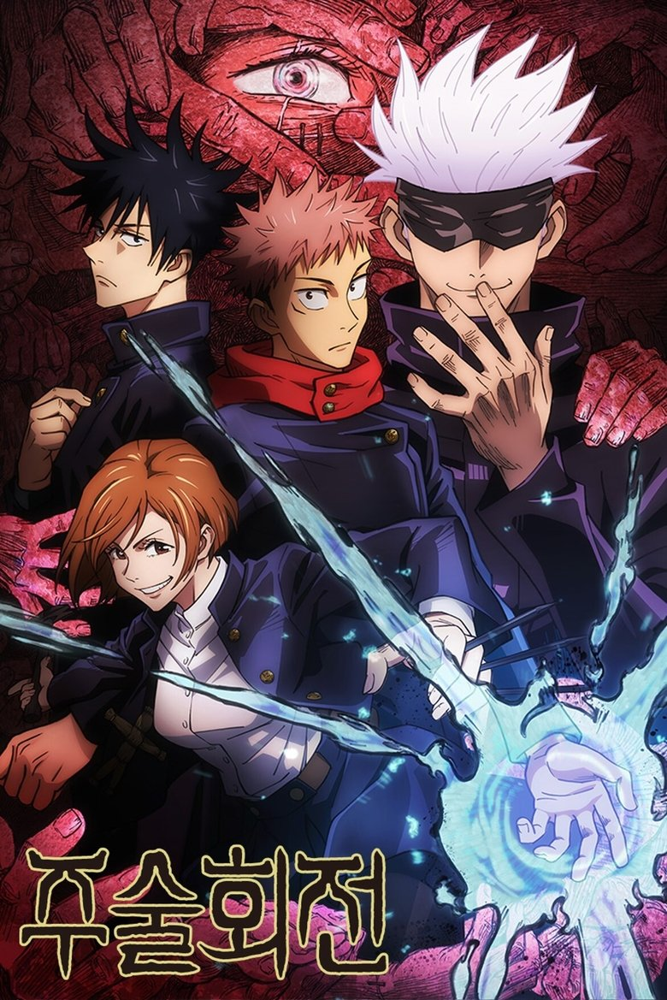
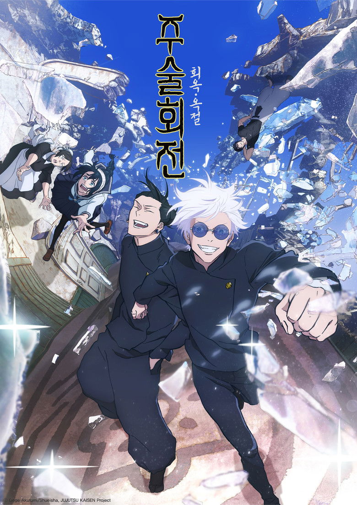

# [2025 봄 애니] JUJUTSU KAISEN Season 3: The Culling Game Part 1 - 정보 & 리뷰

## 💡 도입부

시부야 사변이라는 충격적인 사건을 겪은 주술계가 다시 한번 전대미문의 혼란에 휘말립니다. MAPPA가 선사하는 주술회전 시즌 3는 원작 팬들이 가장 손꼽아 기다리던 '사멸회유(Culling Game)' 편의 서막을 열며, 지금까지와는 전혀 다른 규모와 긴장감으로 시청자들을 압도하고 있습니다.

시부야에서 벌어진 참극 이후, 일본 전역에 걸친 10개의 콜로니에서 동시다발적으로 펼쳐지는 데스게임. 고대 주술사들의 부활, 새로운 플레이어들의 등장, 그리고 이타도리 유지의 사형 집행이라는 위기까지. 주술회전 시즌 3는 단순한 속편을 넘어, 작품 전체의 스케일을 한 단계 끌어올리는 터닝포인트입니다.

**"시부야의 악몽은 끝이 아니라 시작이었다"** - 이 한 문장으로 요약되는 이번 시즌은 액션, 드라마, 미스터리가 완벽하게 조화를 이루며 주술회전 시리즈의 새로운 정점을 찍고 있습니다.

## 📋 기본 정보

- **제목(일)**: 呪術廻戦 死滅回游 前編
- **제목(영)**: JUJUTSU KAISEN Season 3: The Culling Game Part 1
- **장르**: 액션, 드라마, 초자연
- **제작사**: MAPPA
- **방영 시작**: 2025년 10월 3일 (예정)
- **에피소드**: 12화 (Part 1)
- **원작**: 아쿠타미 게게 (芥見下々)
- **감독**: 다카다 요스케, 사토 타케루

### 📊 평점 비교

| 플랫폼 | 평점 | 비고 |
|--------|------|------|
| AniList | 84/100 | 글로벌 커뮤니티 평가 |
| MyAnimeList | 8.59/10 | 랭킹 #110, 멤버 359,876명 |
| TMDB | 8.6/10 | 4,198명 평가 |

### 🎬 스트리밍 정보
- **Crunchyroll**: 공식 스트리밍 (전 세계 동시 방영)
- 한국에서도 자막과 함께 실시간 시청 가능

## 📖 스토리 소개

시부야 사변 이후, 일본 주술계는 돌이킬 수 없는 변화를 맞이합니다. 수많은 주술사들의 희생, 고죠 사토루의 봉인, 그리고 시부야 전역에 퍼진 대량 학살의 참극. 이 모든 것이 '가짜 게토 스구루'로 알려진 카모 노리토시의 계획대로 진행되었고, 그가 준비한 최후의 게임 '사멸회유'가 드디어 막을 올립니다.

사멸회유는 일본 전역 10개 콜로니에서 동시에 진행되는 주술사들의 서바이벌 데스게임입니다. 천 년 전 헤이안 시대의 최강 주술사들이 현대에 부활하고, 평범한 사람들도 주술사로 각성하여 자신의 의지와 관계없이 이 게임에 참가하게 됩니다. 플레이어들은 반드시 19일 이내에 게임에 참여해야 하며, 점수를 얻지 못하면 주술이 해제되어 죽음에 이르게 됩니다.

이타도리 유지는 시부야에서 자신의 몸에 깃든 료멘 스쿠나가 저지른 대학살에 죄책감을 느끼고, 주술고전에 돌아가지 않기로 결심합니다. 대신 그는 새로운 동료 쵸소와 함께 카모 노리토시가 풀어놓은 무수한 저주령들을 퇴치하며 속죄의 길을 걷습니다. 하지만 주술본부는 유지의 사형 집행 유예를 철회하고, 특급 주술사 오쿠츠 유타를 그의 처형인으로 지명합니다.

이번 시즌은 기존의 '주술고전 학생들의 성장기'라는 틀을 완전히 벗어던지고, 각자의 목적을 가진 수십 명의 플레이어들이 복잡하게 얽힌 거대한 체스판으로 무대를 확장합니다. 과거와 현재, 적과 아군의 경계가 모호해지는 가운데, 주술이 지배하던 고대 시대가 다시 도래하려는 암울한 미래가 서서히 드러나기 시작합니다.

## 🎬 주요 캐릭터 & 성우진

### 이타도리 유지 (虎杖悠仁)
시부야에서 스쿠나가 자신의 몸을 빌려 저지른 대학살로 깊은 죄책감에 시달리는 주인공. 주술고전으로 돌아가지 않고 쵸소와 함께 저주령 퇴치에 전념하며 속죄하려 합니다. 이번 시즌에서는 심리적으로 가장 어두운 시기를 맞이하지만, 그럼에도 포기하지 않는 그의 의지가 더욱 빛을 발합니다. '올바른 죽음'이라는 주제가 유지에게 더욱 무겁게 다가오는 시즌입니다.

### 후시구로 메구미 (伏黒恵)
스쿠나가 유독 관심을 보이는 인물로, 이번 시즌에서 그 비밀이 서서히 드러나기 시작합니다. 사멸회유에서 핵심적인 역할을 맡으며, 자신의 술식인 십종어영법의 진정한 가능성을 탐구하게 됩니다. 냉정하고 전략적인 사고방식이 혼란스러운 게임 속에서 빛을 발하며, 동료들을 구하기 위한 그의 결단이 중요한 전환점을 만들어냅니다.

### 오쿠츠 유타 (乙骨憂太)
극장판 '0'에서 주인공으로 활약했던 특급 주술사가 드디어 TV 시리즈에 본격 등장합니다. 해외 수련을 마치고 돌아온 그는 유지의 처형인으로 지명되지만, 그의 진짜 의도는 무엇일까요? 고죠 사토루에 버금가는 잠재력을 지닌 유타의 압도적인 전투력과 리카와의 특별한 관계가 이번 시즌의 중요한 볼거리입니다. 따뜻하지만 단호한 그의 캐릭터가 어두운 스토리에 균형을 더해줍니다.

### 쵸소 (脹相)
시부야 사변에서 적으로 등장했지만, 유지가 자신의 '동생'임을 깨닫고 아군으로 전향한 저주 태아. 형제애에 집착하는 독특한 캐릭터성과 혈액을 조종하는 강력한 술식으로 유지의 든든한 파트너가 됩니다. 진지한 상황에서도 가끔 보여주는 엉뚱한 모습이 작품에 의외의 유머를 선사하며, 유지에게 가족과도 같은 존재로 자리잡습니다.

### 츠쿠모 유키 (九十九由基)
일본에 단 4명뿐인 특급 주술사 중 한 명으로, 주술본부와 독립적으로 활동하는 미스터리한 인물. 저주를 근본적으로 없애는 방법을 연구하는 그녀의 이상론과, 사멸회유에서 그녀가 밝히는 진실들이 스토리에 깊이를 더합니다. 자유분방하면서도 깊은 통찰력을 지닌 캐릭터로, 후배 주술사들에게 새로운 시각을 제시합니다.

### 젠인 마키 (禪院真希)
시부야 사변에서 중상을 입었던 마키가 이번 시즌에서 극적인 변화를 겪습니다. 주술력이 전혀 없다는 약점을 오히려 극한의 강점으로 승화시키며, 젠인 가문과의 치열한 대결을 통해 새로운 경지에 도달합니다. 그녀의 각성 에피소드는 시즌 3에서 가장 강렬하고 감정적인 순간 중 하나로 꼽힙니다.

## ✨ 이 작품의 볼거리 3가지

### 1️⃣ 스케일이 완전히 달라진 배틀 로얄 구조
기존의 '주술고전 vs 저주령/저주사' 구도를 완전히 벗어나, 일본 전역 10개 콜로니에서 수십 명의 플레이어가 동시다발적으로 움직이는 거대한 체스판이 펼쳐집니다. 고대 주술사들의 부활로 전혀 예상할 수 없는 기괴하고 강력한 술식들이 등장하며, 각 캐릭터들의 복잡한 목적과 동맹 관계가 스토리에 긴장감을 더합니다. 단순한 선악 구도가 아닌, 생존, 복수, 이상, 구원 등 다양한 동기가 충돌하는 입체적인 서사가 펼쳐집니다.

### 2️⃣ MAPPA의 한계를 뛰어넘는 작화와 연출력
시부야 사변으로 이미 애니메이션 업계에 새로운 기준을 제시했던 MAPPA가 이번 시즌에서도 그 명성을 이어갑니다. 특히 캐릭터들의 각성 시퀀스와 술식 전투 장면에서 보여주는 역동적인 카메라 워크, 세밀한 작화, 그리고 연출의 창의성은 매 화마다 시청자들을 압도합니다. 다카다 요스케와 사토 타케루 감독의 스타일리시한 연출은 원작의 복잡한 전투 구도를 한층 더 명확하고 박진감 넘치게 전달합니다.

### 3️⃣ 캐릭터들의 심리적 깊이와 성장
이번 시즌은 단순한 액션을 넘어, 각 캐릭터가 겪는 내면의 갈등과 성장에 깊이 있게 접근합니다. 유지의 죄책감과 속죄, 메구미의 정체성 탐구, 마키의 복수와 해방, 유타의 정의관 등 각자의 스토리가 메인 플롯과 유기적으로 연결되며 감정적인 울림을 선사합니다. 특히 '올바른 죽음'이라는 주제가 다양한 캐릭터를 통해 다각도로 탐구되면서, 작품의 철학적 깊이가 한층 더해집니다.

## 🌐 해외 팬 반응

글로벌 애니메이션 커뮤니티에서 주술회전 시즌 3는 2025년 가장 기대되는 작품 중 하나로 손꼽히고 있습니다. TMDB 8.6/10, AniList 84/100이라는 높은 평점이 증명하듯, 시즌 2의 시부야 사변을 뛰어넘는 완성도를 기대하는 목소리가 압도적입니다.

Reddit의 r/anime 커뮤니티에서는 사멸회유 편의 복잡한 룰과 수많은 신규 캐릭터 등장에 대한 기대와 우려가 동시에 표출되고 있습니다. "Netflix is quietly KILLING a passion anime project"라는 논란의 글에서는 스트리밍 플랫폼의 독점 전략이 애니메이션 산업에 미치는 영향에 대한 열띤 토론이 벌어지기도 했습니다. 하지만 주술회전은 Crunchyroll을 통해 전 세계 동시 방영되기 때문에, 이러한 우려에서 비교적 자유롭습니다.

MAL에서 359,876명이라는 압도적인 멤버 수는 작품의 글로벌 인기를 여실히 보여줍니다. 특히 북미와 유럽 지역에서 주술회전은 '귀멸의 칼날'과 함께 2020년대 대표 소년 애니메이션으로 자리잡았으며, 다크 판타지와 하드코어 액션을 선호하는 성인 시청자층에게도 높은 지지를 받고 있습니다. 

원작 팬들 사이에서는 사멸회유 편이 만화에서도 가장 복잡하고 긴 에피소드였던 만큼, MAPPA가 어떻게 이를 12화로 압축하고 시각화할지에 대한 기대가 높습니다. 특히 마키의 각성 에피소드와 유타의 활약은 원작에서도 최고의 순간으로 꼽히는 만큼, 애니메이션화에 대한 기대치가 매우 높은 상황입니다.

## 🎯 이런 분께 추천합니다

**✔️ 다크 판타지와 하드코어 배틀물을 좋아하시는 분**
주술회전은 소년 만화의 틀을 유지하면서도 잔혹한 전개와 어두운 분위기를 주저하지 않습니다. 특히 시즌 3는 시부야 사변의 충격을 이어받아 더욱 무거운 주제를 다루며, 캐릭터들이 겪는 고통과 선택의 무게가 리얼하게 그려집니다.

**✔️ 복잡한 파워 시스템과 전략적 전투를 즐기시는 분**
주술의 다양한 술식과 영역 전개, 그리고 이를 활용한 두뇌 싸움은 헌터X헌터를 연상시키는 깊이를 자랑합니다. 사멸회유의 복잡한 룰과 각 플레이어들의 전략이 맞물리는 과정이 퍼즐을 풀어가는 듯한 재미를 선사합니다.

**✔️ 시부야 사변에서 충격받고 다음 이야기가 궁금하신 분**
시즌 2의 충격적인 결말 이후 주술계가 어떻게 변화했는지, 고죠의 봉인은 어떻게 풀 것인지, 그리고 유지와 스쿠나의 관계는 어떻게 전개될지 궁금하시다면 필수 시청입니다.

**✔️ MAPPA의 고퀄리티 작화를 감상하고 싶으신 분**
진격의 거인 파이널 시즌, 체인소맨 등으로 명성을 쌓은 MAPPA의 최고 수준 작화와 연출을 즐기실 수 있습니다. 특히 액션 시퀀스에서 보여주는 역동성과 세밀함은 극장판 퀄리티에 육박합니다.

### 📺 비슷한 작품을 좋아하신다면
- **귀멸의 칼날 (Kimetsu no Yaiba)**: 다크 판타지와 압도적인 작화를 좋아한다면. 주술회전이 좀 더 복잡한 파워 시스템과 현대적 배경을 다룬다면, 귀멸의 칼날은 더 감성적이고 전통적인 접근을 보여줍니다.
- **블리치 천년혈전편 (BLEACH: Sennen Kessen-hen)**: 다양한 캐릭터들이 각자의 능력으로 싸우는 대규모 배틀을 선호한다면. 주술회전의 주술 시스템은 블리치의 참혼도 능력과 유사한 재미를 줍니다.
- **도로헤도로 (Dorohedoro)**: 독특한 세계관과 잔혹한 표현, 그리고 블랙 코미디를 즐긴다면. 좀 더 언더그라운드적인 분위기를 원하시는 분께 추천합니다.

## ⭐ 총평

**평점: ⭐⭐⭐⭐⭐ 4.3/5**

주술회전 시즌 3는 원작의 가장 복잡하고 야심찬 에피소드를 애니메이션화하는 도전적인 과제를 훌륭하게 수행하고 있습니다. 시부야 사변이 강렬한 한 방으로 시청자를 압도했다면, 사멸회유 편은 거대한 체스판 위에서 펼쳐지는 치밀한 전략전으로 또 다른 매력을 발산합니다.

**강점**은 확실합니다. MAPPA의 작화와 연출은 여전히 업계 최고 수준이며, 다수의 캐릭터와 복잡한 플롯을 효과적으로 정리하는 각색 능력이 돋보입니다. 특히 각 캐릭터의 내면을 깊이 있게 탐구하면서도 액션의 박진감을 놓치지 않는 균형감이 뛰어납니다. 마키, 유타 등 기존 캐릭터들의 새로운 면모와 신규 등장인물들의 개성 넘치는 술식은 12화 내내 신선함을 유지합니다.

**아쉬운 점**이 있다면, 워낙 많은 신규 캐릭터가 단기간에 등장하다 보니 각각에게 충분한 소개와 비중을 할애하기 어렵다는 점입니다. 원작을 읽지 않은 시청자들은 일부 전개가 다소 혼란스럽게 느껴질 수 있습니다. 또한 Part 1이 12화로 제한되어 있어, 사멸회유의 진짜 클라이맥스는 Part 2를 기다려야 한다는 점도 아쉽습니다.

그럼에도 불구하고, 주술회전 시즌 3는 2025년 가장 주목받는 애니메이션 중 하나로 손색이 없습니다. 시부야의 충격에서 회복하지 못한 팬이라면, 이번 시즌은 그 충격을 뛰어넘는 새로운 경험을 선사할 것입니다.

**"올바른 죽음을 향해 달려가는 소년들의 이야기, 그 두 번째 막이 오른다."**

---

**#주술회전 #呪術廻戦 #JUJUTSUKAISEN #주술회전시즌3 #사멸회유 #CullingGame #MAPPA #이타도리유지 #오쿠츠유타 #다크판타지 #배틀애니 #2025년애니 #크런치롤 #소년애니 #액션애니추천**