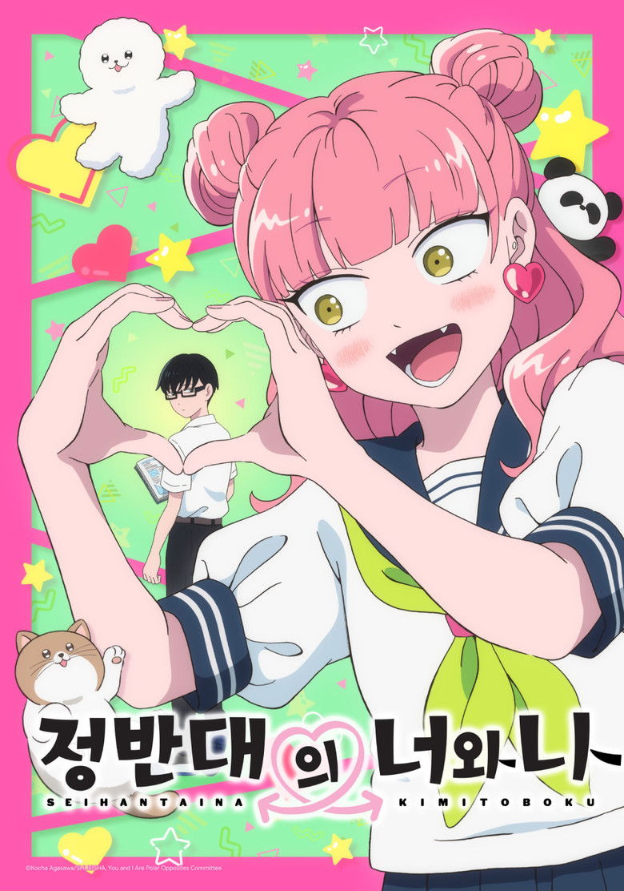

# [2026 겨울 애니] 정반대의 너와 나 - 정보 & 리뷰

## 💡 도입부

2026년 겨울, 애니메이션 팬들 사이에서 조용하지만 확실하게 입소문을 타고 있는 작품이 있습니다. 바로 '정반대의 너와 나'입니다. Reddit r/anime에서 첫 화 토론 글이 452개의 댓글을 기록하며 뜨거운 반응을 얻었고, "여자친구 칭찬하기"라는 제목의 짧은 클립 하나가 3,477개의 추천을 받으며 커뮤니티를 강타했습니다. 이 작품이 이토록 많은 사람들의 마음을 움직인 이유는 무엇일까요?

흔히 보던 학원 로맨스 애니메이션이라고 생각한다면 큰 오산입니다. 이 작품은 '정반대'라는 키워드를 단순한 설정이 아닌, 관계의 본질을 탐구하는 도구로 활용합니다. 명랑하지만 타인의 시선에 민감한 소녀 스즈키와, 과묵하지만 자신의 신념을 당당히 표현하는 소년 타니. 두 사람의 만남은 단순한 '반대 성격 끌림'을 넘어, 서로를 통해 자신의 약점을 보완하고 성장하는 아름다운 여정을 그려냅니다.

**'다른 것'이 두려움이 아닌 매력이 될 수 있다는 것.** 이것이 바로 '정반대의 너와 나'가 전하는 핵심 메시지이자, 2026년 겨울을 따뜻하게 만들어줄 힐링 로맨스의 정수입니다.

## 📋 기본 정보

- **제목**: 정반대의 너와 나 (正反対な君と僕 / You and I Are Polar Opposites)
- **장르**: 로맨스, 코미디, 드라마, 일상
- **제작사**: Lapin Track
- **방영 시작**: 2026년 1월 11일
- **에피소드 수**: 12화
- **원작**: 코우차 아가사와(Koucha Agasawa)의 만화
- **감독**: 나가토모 타카카즈
- **시리즈 구성**: 우츠미 테루코
- **스트리밍**: Crunchyroll (한국 포함 글로벌 동시 방영)

### 📊 3사 평점 비교

| 플랫폼 | 평점 | 비고 |
|--------|------|------|
| **AniList** | 80/100 | 글로벌 애니 커뮤니티 |
| **MyAnimeList** | 8.18/10 | 전체 #452위, 107,912명 멤버 |
| **TMDB** | 8.7/10 | 13명 평가 (초반 평가) |

MAL 기준 인기순위 #2,233위는 방영 초기임을 감안하면 상당히 빠른 인지도 상승세를 보여주고 있으며, 10만 명이 넘는 멤버 수는 이미 충분한 기대작임을 증명합니다.

## 📖 스토리 소개

무대는 평범한 일본의 고등학교. 우리가 모두 경험했거나 상상해본 그런 일상적인 공간입니다. 하지만 이 평범함 속에서 벌어지는 이야기는 결코 평범하지 않습니다. 교실 한편에는 항상 웃는 얼굴로 친구들과 어울리는 스즈키 미유가 있고, 다른 한편에는 조용히 창밖을 바라보는 타니 유우스케가 있습니다. 두 사람의 세계는 같은 공간을 공유하면서도 완전히 다른 색깔로 칠해져 있습니다.

스즈키는 언제나 명랑하고 긍정적인 성격의 소유자입니다. 하지만 그녀의 밝음 뒤에는 작은 비밀이 숨어 있습니다. 그녀는 주변 사람들의 시선과 평가에 지나치게 민감합니다. 남들이 자신을 어떻게 볼지, 자신의 행동이 어색하지 않은지 끊임없이 걱정합니다. 반면 타니는 과묵하고 표현이 적지만, 자신이 옳다고 생각하는 것은 타인의 시선과 관계없이 당당히 말하고 실천하는 인물입니다.

그런 스즈키가 타니에게 끌리기 시작합니다. 처음에는 그저 '신기한 사람'이었던 타니가, 점차 그녀가 가지지 못한 '자유로움'을 상징하는 존재로 다가옵니다. 하지만 자신과 정반대인 그에게 어떻게 다가가야 할지, 과연 자신 같은 사람이 그의 세계에 들어갈 수 있을지 고민이 깊어집니다. 이 작품의 핵심 갈등은 바로 여기에 있습니다. 서로 다른 두 사람이 어떻게 서로를 이해하고, 받아들이며, 결국 함께 성장해나가는가 하는 것입니다.

원작 만화는 코우차 아가사와의 따뜻한 시선과 섬세한 심리 묘사로 많은 사랑을 받아왔습니다. 애니메이션은 이러한 원작의 장점을 충실히 살리면서도, 움직임과 음악, 성우들의 연기를 통해 더욱 생동감 있는 캐릭터들을 만들어냅니다. 특히 스즈키의 내면 독백과 타니의 미묘한 표정 변화를 포착하는 연출이 원작 팬들에게도 호평을 받고 있습니다.

## 🎬 주요 캐릭터 & 성우진

### 스즈키 미유 (鈴木みゆ) - MAIN
이 작품의 주인공이자 화자. 밝고 사교적인 여고생으로, 친구들 사이에서 인기가 많습니다. 갸루 스타일의 외모와 명랑한 성격으로 언제나 주목받지만, 내면에는 타인의 평가에 대한 불안이 자리하고 있습니다. 타니의 당당함에 끌리며 그에게 점점 빠져들지만, 정반대인 두 사람이 잘 어울릴 수 있을지 고민합니다. 그녀의 내면 성장 과정이 작품의 주요 줄거리를 이끌어갑니다.

### 타니 유우스케 (谷悠介) - MAIN
과묵하고 조용한 남학생. 표정 변화가 적고 말수도 적지만, 자신의 의견은 명확히 표현하는 인물입니다. 주변 시선에 크게 개의치 않으며, 자신만의 페이스를 유지합니다. 스즈키와는 정반대 성격이지만, 그녀의 진심을 알아보고 점차 마음을 열어갑니다. 그의 성장은 스즈키보다 은근하게 그려지지만, 그만큼 깊이가 있습니다.

### 타이라 슈우지 (平秀司) - SUPPORTING
타니의 친구로, 비교적 사교적인 성격입니다. 정반대인 두 사람의 관계를 옆에서 지켜보며 때로는 조언자, 때로는 관찰자 역할을 합니다. 코믹 릴리프 역할도 하면서 작품의 분위기를 밝게 만들어줍니다.

### 아즈마 시노 (東紫乃) - SUPPORTING
스즈키의 친구 중 한 명으로, 그녀의 고민을 함께 나누는 인물입니다. 여자들끼리의 솔직한 대화 장면에서 중요한 역할을 하며, 스즈키가 자신의 감정을 정리하는 데 도움을 줍니다.

### 야마다 켄타로 & 와타나베 마나미 - SUPPORTING
학교 친구들로, 각자의 개성으로 학원 생활의 생동감을 더합니다. 이들과의 일상적인 에피소드가 주인공들의 관계 변화를 더욱 돋보이게 만듭니다.

성우진에 대한 상세 정보는 아직 공개되지 않았지만, Lapin Track의 캐스팅 센스를 고려할 때 캐릭터의 섬세한 감정선을 잘 살릴 수 있는 실력파들이 선정될 것으로 기대됩니다.

## ✨ 이 작품의 볼거리 3가지

### 1. 정반대가 만들어내는 케미스트리 💕
단순히 '반대 성격 끌림'이 아닌, 서로의 약점을 보완하고 장점을 배우는 과정이 섬세하게 그려집니다. 스즈키는 타니를 통해 자신답게 사는 법을 배우고, 타니는 스즈키를 통해 타인과 진심으로 연결되는 법을 익혀갑니다. 두 사람의 대화 하나하나, 시선의 교환 하나하나가 관계의 변화를 보여주는 이 작품의 연출력은 단연 압권입니다.

### 2. 현실적이고 공감되는 고등학생의 일상 🏫
과장되거나 극적인 사건 없이, 교실에서의 소소한 대화, 방과 후 함께 걷는 길, 친구들과의 농담 같은 평범한 순간들이 주를 이룹니다. 하지만 이 평범함 속에 누구나 공감할 수 있는 진짜 감정들이 녹아 있습니다. 타인의 시선이 두려워 본심을 숨기는 경험, 좋아하는 사람 앞에서 어색해지는 순간들이 너무나 현실적으로 묘사됩니다.

### 3. 힐링되는 연출과 분위기 🌸
'Iyashikei(이야시케이)' 태그가 붙은 이 작품은 시청자에게 편안함과 치유를 선사합니다. 부드러운 색감, 따뜻한 배경음악, 서두르지 않는 스토리 전개가 마음을 편안하게 만듭니다. Reddit 댓글에서도 "이 애니를 보고 나면 세상이 조금 더 따뜻해 보인다"는 반응이 많을 정도입니다. 바쁜 일상에 지친 시청자들에게 꼭 필요한 힐링 타임을 제공합니다.

## 🌐 해외 팬 반응

Reddit r/anime 커뮤니티에서 이 작품은 방영 직후부터 폭발적인 반응을 얻었습니다. 1화 토론 스레드가 452개의 댓글을 기록했으며, "여자친구 칭찬하기"라는 짧은 장면을 캡처한 게시물은 3,477개의 추천을 받으며 r/anime 인기 게시물 상위권에 올랐습니다. 

해외 팬들이 특히 주목한 점은 **"건강한 관계의 묘사"**입니다. 많은 로맨스 애니메이션이 오해와 갈등을 드라마의 주요 요소로 사용하는 반면, 이 작품은 서로를 존중하고 이해하려는 노력을 중심에 둡니다. "Finally, a romance anime where characters actually communicate(드디어 캐릭터들이 제대로 대화하는 로맨스 애니)"라는 댓글이 높은 공감을 얻었습니다.

AniList 80점, MAL 8.18점이라는 점수는 로맨스 장르에서 상당히 높은 평가입니다. TMDB의 8.7점은 평가자 수가 적어 변동 가능성이 있지만, 초기 시청자들의 만족도가 매우 높음을 보여줍니다. 특히 20대 초중반 시청자들 사이에서 "내가 고등학생 때 이런 애니가 있었다면 좋았을 것"이라는 향수 어린 반응과, 현재 청소년 시청자들의 "내 이야기 같다"는 공감 반응이 공존하는 것이 흥미롭습니다.

일본 내에서도 TBS, MBS 등 주요 방송국 20여 개 채널에서 동시 방영될 정도로 기대를 모았으며, Twitter(X)에서는 매 회 방영 후 관련 해시태그가 트렌드에 오르고 있습니다.

## 🎯 이런 분께 추천합니다

**📚 일상계 로맨스 애니메이션을 좋아하시는 분**
'Skip to Loafer'나 'Horimiya'처럼 과장 없이 진솔한 고등학생 로맨스를 그린 작품을 좋아하신다면 반드시 보셔야 합니다. 특히 극적인 전개보다 캐릭터의 내면 변화와 성장에 집중한 스토리를 선호하신다면 완벽한 선택입니다.

**💑 건강한 관계 묘사를 원하시는 분**
독성 있는 관계나 불필요한 오해가 반복되는 드라마에 지치셨다면, 이 작품이 해답입니다. 서로를 존중하고 소통하려 노력하는 두 주인공의 모습은 현실의 관계에서도 배울 점이 많습니다.

**🌱 자기 긍정과 성장 이야기를 좋아하시는 분**
단순한 로맨스를 넘어, 주인공들이 서로를 통해 자신의 약점을 극복하고 성장하는 Coming of Age 스토리를 원하신다면 추천합니다. 특히 타인의 시선 때문에 힘들어하시는 분들께는 큰 위로가 될 것입니다.

**😌 힐링이 필요하신 분**
바쁜 일상에 지쳐 마음의 여유가 필요하시다면, 이 작품의 따뜻하고 편안한 분위기가 완벽한 힐링 타임을 제공할 것입니다.

### 비슷한 작품 추천
- **Skip to Loafer** (AniList 81/100): 시골 소녀와 도시 남학생의 순수한 청춘 로맨스. 현실적인 캐릭터 묘사가 일품입니다.
- **Horimiya** (AniList 81/100): 겉모습과 다른 진짜 자신을 보여주는 과정을 그린 학원 로맨스. 캐릭터 간 케미스트리가 뛰어납니다.
- **Sono Bisque Doll wa Koi wo Suru** (AniList 80/100): 다른 세계의 두 사람이 취미를 통해 가까워지는 이야기. 밝고 긍정적인 분위기가 매력적입니다.

## ⭐ 총평

'정반대의 너와 나'는 2026년 겨울 애니메이션 중 가장 따뜻한 마음을 전해주는 작품입니다. 화려한 액션이나 극적인 반전은 없지만, 그 대신 진짜 감정의 울림이 있습니다. 스즈키와 타니, 정반대인 두 사람이 서로를 통해 배우고 성장하는 과정은 단순한 로맨스를 넘어 우리 모두의 관계에 대해 생각하게 만듭니다.

**강점**으로는 섬세한 심리 묘사, 현실적이고 공감되는 캐릭터, 건강한 관계의 묘사, 힐링되는 연출과 분위기를 꼽을 수 있습니다. 특히 대화와 소통을 통해 관계가 발전하는 모습은 많은 로맨스 작품들이 배워야 할 부분입니다. Lapin Track의 작화도 안정적이며, 캐릭터의 미묘한 표정 변화를 잘 포착합니다.

**약점**을 굳이 찾자면, 조용하고 느린 전개가 자극적인 스토리를 선호하는 시청자에게는 지루하게 느껴질 수 있다는 점입니다. 또한 극적인 사건이 적어 몰입하기까지 시간이 필요할 수도 있습니다. 하지만 이는 작품의 지향점을 고려하면 약점이라기보다는 특성에 가깝습니다.

AniList 80점, MAL 8.18점이라는 평점은 이 작품의 완성도를 잘 보여줍니다. 장르 특성상 만점을 받기 어렵지만, 일상계 로맨스 팬들에게는 그 이상의 가치를 지닌 작품입니다. 12화라는 적당한 분량도 부담 없이 시청하기 좋습니다.

**⭐⭐⭐⭐☆ 4.5/5**

**"다름이 서로를 완성한다. 정반대이기에 더욱 아름다운, 2026년 겨울 최고의 힐링 로맨스."**

Crunchyroll에서 한국어 자막으로 감상 가능하니, 추운 겨울을 따뜻하게 녹여줄 이 작품을 꼭 만나보시기 바랍니다. 12화가 끝날 때쯤이면, 여러분도 스즈키처럼 조금은 더 당당해지고, 타니처럼 조금은 더 열린 마음을 가지게 될 것입니다.

---

**#정반대의너와나 #2026겨울애니 #일상계로맨스 #학원물 #힐링애니 #청춘로맨스 #ComingOfAge #LapisTrack #크런치롤 #애니메이션추천 #Iyashikei #순정만화감성 #건강한관계 #공감로맨스 #갸루히로인**